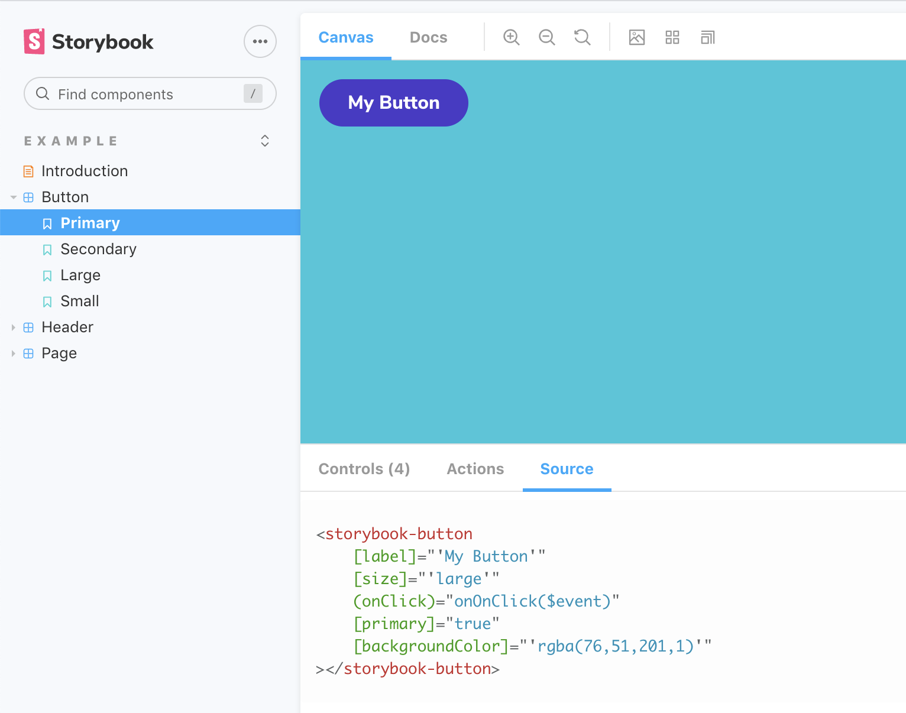

# Storybook Addon Angular Source

This addon for Storybook adds a tab that displays angular template code for each
story. It uses [prismjs](https://prismjs.com/) for syntax highlighting.



## Getting Started

With NPM:

```sh
npm i --save-dev @gilsdav/storybook-angular-source
```

With Yarn:

```sh
yarn add -D @gilsdav/storybook-angular-source
```

### Register addon

```js
// .storybook/main.js

module.exports = {
  // ...
  addons: [
    '@gilsdav/storybook-angular-source',
    // ...
  ],
};
```

